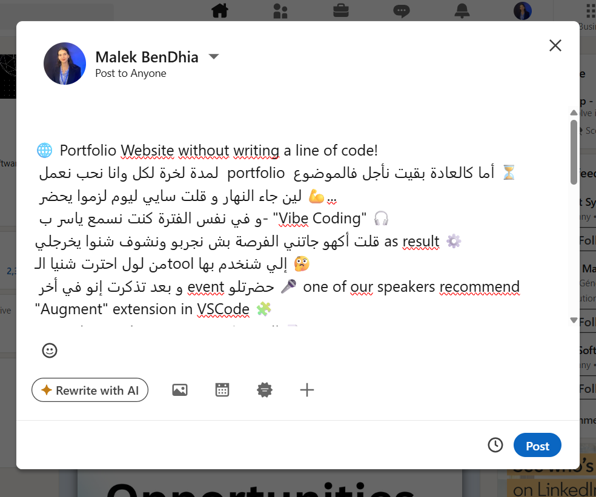
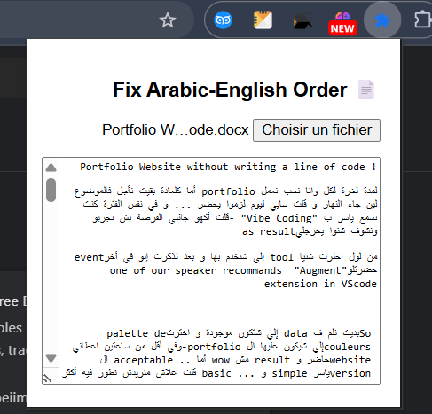
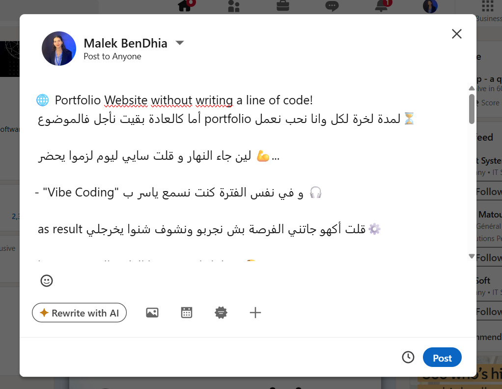

# 🧩 textFixerExtension

> A simple Chrome Extension that preserves the correct word order in multilingual texts (especially Arabic + English), fixing the copy-paste issues on platforms like LinkedIn where the meaning often gets distorted.

---

## 📌 Problem This Solves

When writing a text that mixes **Arabic (RTL)** and **English (LTR)** in tools like Word or Google Docs, copying and pasting into platforms like **LinkedIn** often breaks the **natural order of words**, altering the intended meaning.

---

## ✅ Features

- 📄 Read `.docx` (Word) files directly
- 🔄 Automatically fix RTL/LTR word order
- 👀 Live preview of the corrected output
- 🧼 Clean and simplified copy-ready text

---

## 🚀 How to Use the Extension

1. **Clone or download** this repository
2. Open **Google Chrome** and go to `chrome://extensions/`
3. Enable **Developer mode** (top right corner)
4. Click on **"Load unpacked"**
5. Select the project folder (`textFixerExtension`)
6. Open the extension, upload your `.docx` file, and copy the corrected text 🎉

---

## 📷 Preview

---

